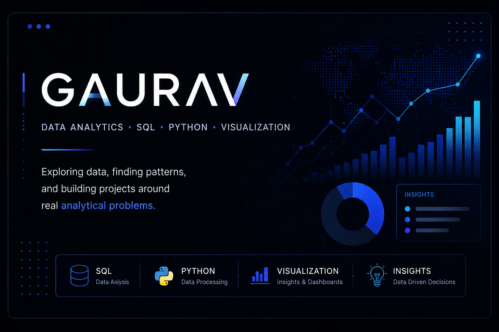

  

 

<h1 align="center">Hi, I'm Gaurav 👋</h1>

  Exploring data, finding patterns, and building analytical projects.

  <code>SQL</code> •
  <code>Python</code> •
  <code>Data Analysis</code> •
  <code>Visualization</code>

---

## About Me

I'm currently pursuing a B.Tech in AI & Data Science and focusing on building practical skills in data analytics.

I work with data to explore patterns, answer questions, and turn raw information into useful insights. Along the way, I'm building projects involving analytics, SQL, Python, data visualization, and data pipelines.

**Currently working on:**

* 📊 Customer retention and churn analytics
* 🧪 A/B testing and experiment analysis
* ⚙️ Building production-style data projects
## 🚀 Projects

This profile documents the projects I build while developing my skills in data analytics and working with real-world data.

Current areas of focus include:

* 📊 Customer Retention & Churn Analytics
* 📈 Business and Product Analytics
* 🧪 A/B Testing & Experiment Analysis
* 🗄️ SQL-based Data Analysis

More projects will be added as they are completed.

## 🛠️ Tools & Technologies

  <code>Python</code> •
  <code>SQL</code> •
  <code>MySQL</code> •
  <code>Pandas</code> •
  <code>NumPy</code> •
  <code>Power BI</code> •
  <code>Git</code>

## 📊 GitHub Activity

  

---

## 📫 Connect With Me

  <a href="https://www.linkedin.com/in/gaurav-dev-641351365/">
    LinkedIn
  </a>
  •
  <a href="mailto:gauravdev339@gmail.com">
    Email
  </a>

 

  <i>Learning through projects, one dataset at a time.</i>

